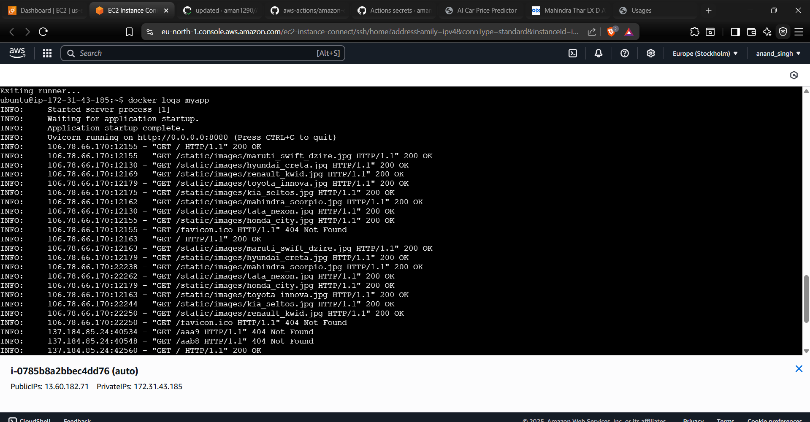

# AutoPrice-AI 🚗💰

**End-to-End Machine Learning System for Used Vehicle Price Prediction**

---

## Table of Contents
- [📌 Introduction](#-introduction)
- [💼 Business Problem](#-business-problem)
- [🛠 Tech Stack](#-tech-stack)
- [⚙ Architecture & Workflow](#-architecture--workflow)
- [🧪 Features & ML Pipeline](#-features--ml-pipeline)
- [🐳 Docker & Deployment](#-docker--deployment)
- [🧪 Testing & Experiment Tracking](#-testing--experiment-tracking)
- [🎯 Usage](#-usage)
- [📎 Visuals](#-visuals)
- [📝 Future Improvements](#-future-improvements)

---

### 📌 Introduction
AutoPrice‑AI automates the entire vehicle price prediction pipeline—from ingestion to deployment—ensuring reproducible, production-grade ML workflows.

---

### 💼 Business Problem
Accurately predicting used vehicle prices helps dealerships and resellers maximize profits, detect mispriced vehicles, and minimize financial risk by tying price to historical sales and market indicators.

---

## 🛠 Tech Stack
| Component          | Technologies                                                                 |
|--------------------|-----------------------------------------------------------------------------|
| **Core ML**        | Scikit-learn, XGBoost, LightGBM                                             |
| **Data Pipeline**  | pandas, Feature-engine, Great Expectations                                  |
| **Backend**        | FastAPI, Uvicorn, SQLite                                                    |
| **Frontend**       | Bootstrap, Jinja2, Chart.js                                                 |
| **Infrastructure** | Docker, AWS (EC2/ECR/IAM), GitHub Actions                                   |
| **Monitoring**     | MLflow, SHAP, pytest  

---

## ⚙ Architecture & Workflow
graph LR
    A[Data Scraping] --> B[Raw Data.zip]
    B --> C[Data Ingestion]
    C --> D[Validation]
    D --> E[Transformation]
    E --> F[Model Training]
    F --> G[MLflow Tracking]
    G --> H[FastAPI Serving]
    H --> I[Docker Image]
    I --> J[AWS Deployment]

## 🧪 Features & ML Pipeline
- **2000+ real vehicle listings** from multiple sources
- **Modular ML pipeline** (ingestion → validation → training → deployment)
- **Experiment tracking** with MLflow
- **Dockerized FastAPI** serving with interactive UI
- **AWS cloud deployment** (ECR/EC2/IAM) via CI/CD

## 🐳 Docker & Deployment
.png)

## 🧪 Testing & Experiment Tracking
.png)

## 🎯 Usage
''' bash

git clone https://github.com/aman1290/AutoPrice-AI.git
cd AutoPrice-AI

# Install dependencies
pip install -r requirements.txt

# Run training pipeline
python src/pipeline/training_pipeline.py or python main.py

# Launch API
uvicorn app:app --reload

## 📎 Visuals
.png)
.png)

## 📝 Future Improvements
- use paid/custom made api to fetch car data and autofill while the user only enters car number to improve user experience
- use other models 
- extratct more valid features

